Computer Controlled Cutting
---------------------------

[This weeks
class](http://academy.cba.mit.edu/classes/computer_cutting/index.html)of
Fab Academy 2015 was about using CAM machines to cut things. This is one
of me favorite subjects and I am looking forward to what I am making.

To quote Prof Niel Gershenfeld

> There some skill and some variability. You have to set the force you
> cut with, You have to set the pressure and you have to set the depth
> of cut. And those settings depend on what you eat for breakfast.

My plan: Day 1 - Design a Press Fit Fashion Mannequin, Order Material
Day 2 - Test Cuts Day 3 - Mods and recut Day 4 - Vinyl Cutting if there
is time.

The idea for press fit mannequins is nothing new. Armani made a series
for their store maneqquins in 2003 and the design team Arash + Kelly
made a series a few years ago. [Genius! A Flat-Pack Mannequin -
Ecouterre](http://www.ecouterre.com/genius-a-flat-pack-mannequin-for-designers-on-the-go/)
Both are no longer available commercially so I wanted to make a version
for the FabLab’s, especially considering that projects like [OpenKnit |
open source digital knitting](http://openknit.org/) are making clothing
possible in a Fab Lab near you. So I started with a 3D scan of a Royal
10 women’s dress mannequin. I separated the pieces using traditional
draping design techniques in 3D. I noted that on the Armani and the
Arash + Kelly versions that both used a Raglan Sleeve styling. I suspect
that this has to do structural integrity around the armhole and neck so
I will follow their lead.\
 I’ve tried my best to flatten the .stl mesh into a flat pattern, but
all of the flattening programs I can find costs at least 2000\$.\
 Yet since the Royal 10 is the equivalent of a size 8 dress form I used
my size 8 Flat Pattern Making blocks to recreate a flat version in
Illustrator.

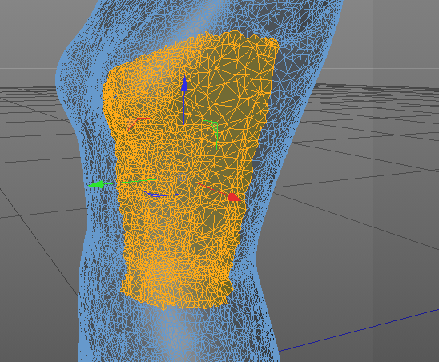

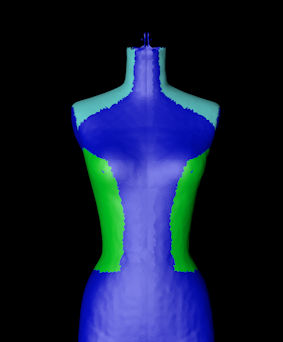

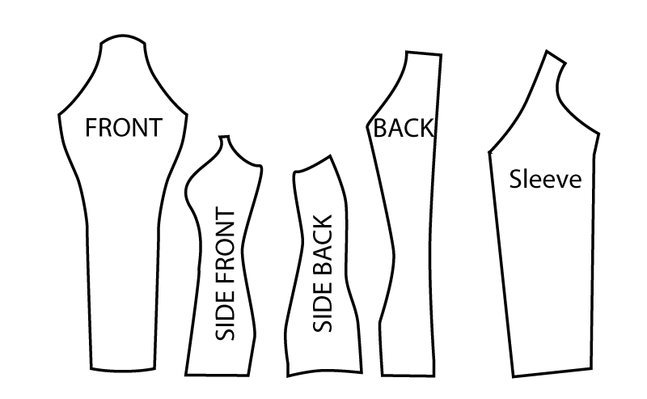

Press fit is a great idea, but in situations such as connecting curved
surfaces an non linear poly lines it is impossible to use. Yet in
clothing design we already have a series of soft options; Buttons, Zips
and Velcro.

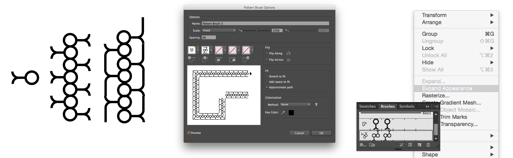

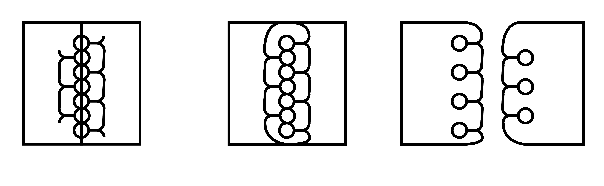

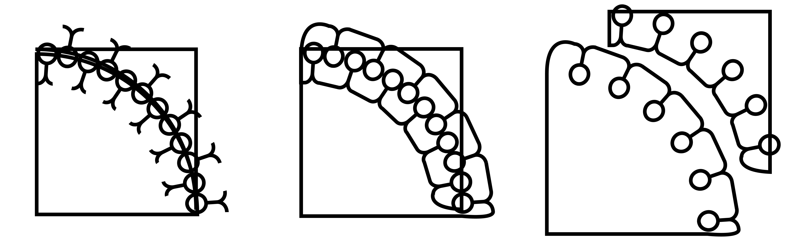

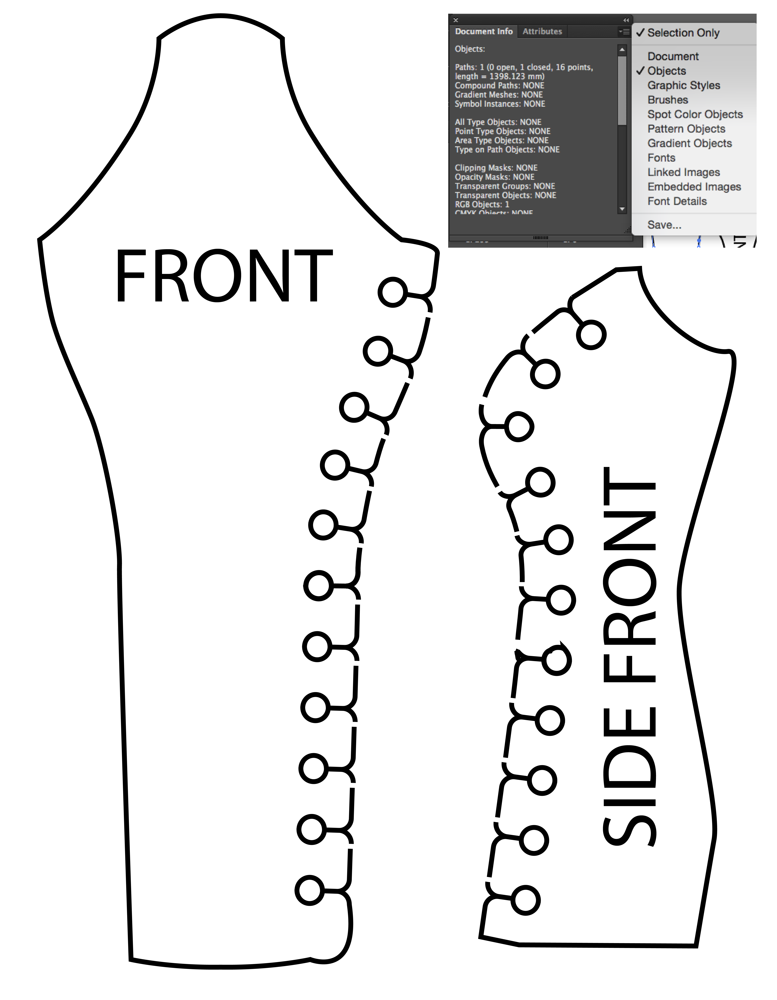

While others have tried to great success the zipper I want try a hybird
button/zipper combination that will limit assembly time. At the angles
I’ll use a button system to provide stability with the zipper system in
between.

I tried a series of cardboard trials. I was surprised by the fact that
the larger I scale the better it works. I am redesigning the system. In
Illustrator I created a positive shape based off the negative left
behind by 2 C’s that create the opposite end of the C’s . Some of the
curves are really tight and required some adjustment, but the seam line
is always the same size.

Learning from the first prototype. Interestingly enough. the zipper
system works well everywhere except where things are very straight
(Center Front and Center Back). I am going to try eliminating Center
front and try a tighter, flatter system for the back. I used 2mm Bayer
Vivak to make it strong, but it is too think in places and is cracking
if two pieces twist really hard. It’s not impossible to assemble, but
next time I will pick a thinner version of the material. (I see now why
the other versions I found on the web are typically in the softer
Delrin.) There were some fit issues around the neck and armhole. The
rest looks pretty good.

I adjusted the design and ran another copy. In adding the new closure to
the center back I accidentally cut two lefts and not a right. I recut
the piece but had to use a piece that already had a little cut in it as
I was out of Material.

Things came together well. I am happy with where it is at, Free
Standing, Hangable, and Supportive( a full mens coat didn’t collapse
it.) I would love to do one more iteration to fine tune a few more
things and adjust the interlock. the interlock is precise, but that is
causing some tears in the male parts. I need to leave some wear and tear
room in there, just like the 10000 year clock by the long now
foundation.

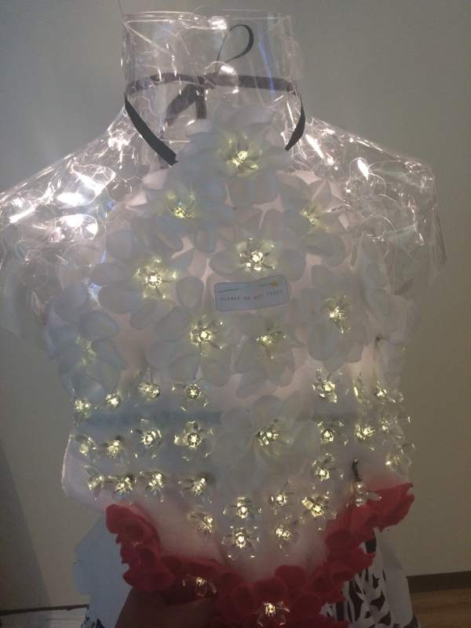

I didn’t have a lot of time to finish the stickers on the vinyl cutter,
but I wanted to make some graphics for the lab. I didn’t want to waste
any material so I made something where the negative was as interesting
as the positive. Fine details didn’t come out great and getting the
cutter homed was a challenge. Our local Fab Instructor Fiore helped me
transfer the design to transfer medium and showed me how to shear off a
wall after the first try was a disaster.

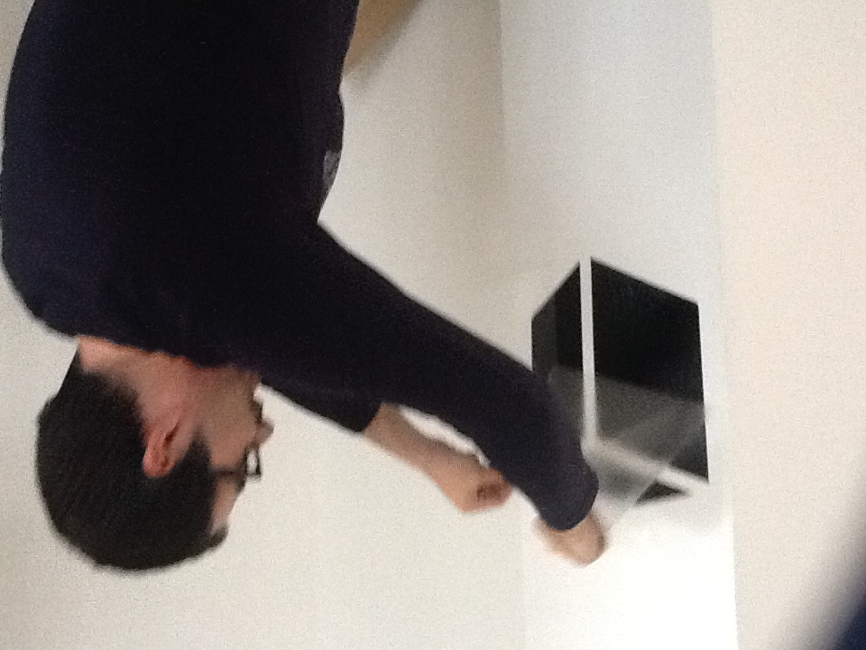

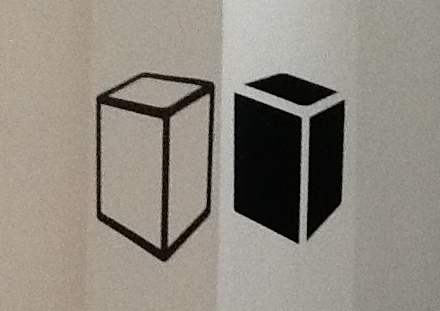

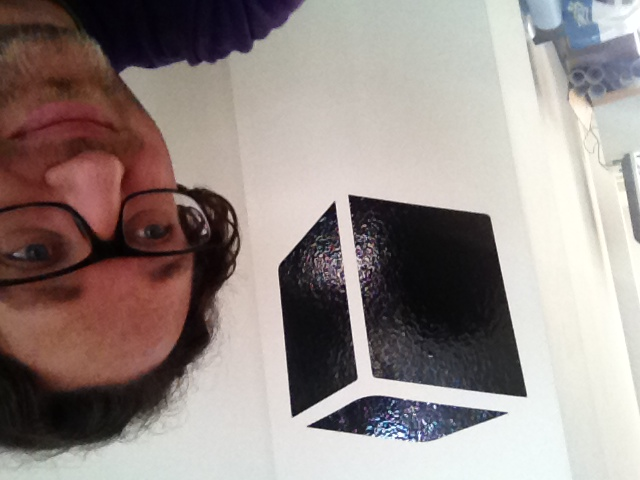

-   [Twitter](https://twitter.com/troykyo)
-   [Github](https://github.com/troykyo)
-   [Facebook](https://www.facebook.com/troykyo)
-   [Email](#Contact)

<!-- -->

-   CC Troy Nachtigall
-   Design: [HTML5 UP](http://html5up.net)

